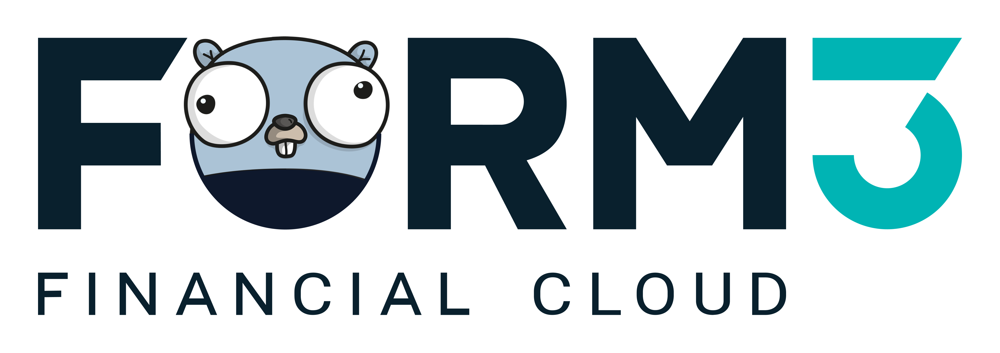

# Hi. We're [Form3](https://www.form3.tech/) 👋

## Form3 at a glance
- High volume multi-cloud architecture 🚀
- Build with cloud native technologies ☁️
- SecDevOps engineering culture 🔐
- Remote-first with staff in 20+ countries 🌍

We are an award-winning cloud-native payment technology provider for financially regulated business. 
We connect those regulated businesses to payment schemes all over the world so that they can deliver amazing products for their customers.  
When you look around at how the world has changed, there’s this big divergence. The real economy has moved into a fast-paced, digital, real-time landscape; yet payments technology hasn’t quite kept pace. We are on a mission to redefine what a truly instant payment experience means. 

Why? Because we share an unwavering belief in an API driven payment future.

## The opportunity 🎉

At Form3 you will have the opportunity to: 
- Design, develop and deploy backend cloud-native services within a powerful state-of-the-art microservices architecture. The work is cutting edge, constantly changing and focused on building highly available, low latency, scalable solutions. 
- Play an active role in introducing new technologies and ways of working to stay ahead of the competition, without ever compromising on quality. 
- Contribute and collaborate with other engineers on technical and architectural decisions. 
- Enjoy end-to-end ownership from concept to deployment, including building and operating infrastructure, toolset and deployment pipelines. 
- Develop your skills, work on cool projects and the latest tech, all whilst working with a talented, diverse and friendly group of people.

## How we interview 🤝

**Phone Screen** ☎️   
An initial telephone call with a member of our Talent Team.

**Take Home Exercise** 🏡  
Candidates are asked to complete a take home technical exercise in Go. Read more about our approach to [the technical coding task](./pages/coding-task.md).

**Video Interview** 🎥  
Technical interview with 3 members of the Engineering Team via video-link. For further information on our interview process, please see the [FAQs](./pages/faq.md).

## Learn more about us! 🙌
Read more about all things engineering on our [engineering site](https://www.form3.tech/engineering) and at [@Form3Tech on Twitter 🐦 ](https://twitter.com/Form3Tech).

Have a look at these other pages for more interviewing details:
- **[Visa sponsorship](./pages/visa-sponsorship.md)** 🛫
- **[What we look for](./pages/what-we-look-for.md)** 🔎
- **[FAQ](./pages/faq.md)** 🤨
  
## Ready to take the leap? 💯 
Head over to our **[careers site](https://www.form3.tech/careers)** to see our open roles and make an application! 

We look forward to hearing from you! 🥳
