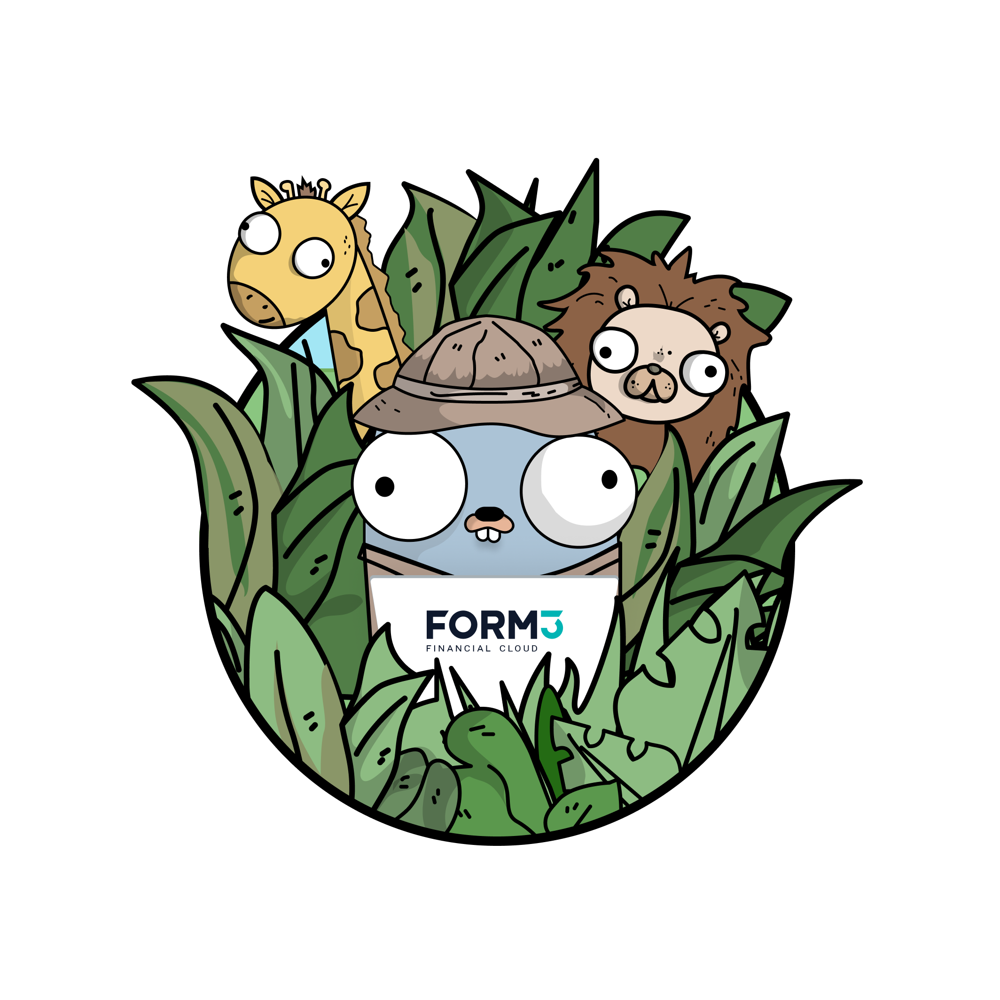

# How we work 🎳

## Remote working

Form3 has been built as a remote-friendly company with a remote-first engineering team. We are well-practiced in remote-working and have all of the processes in place for our employees to work seamlessly, wherever they are based. 
Slack, Zoom and Microsoft Teams are part of our day-to-day toolset. For impromptu coffee breaks we have “Donuts” and to check in with the hearts and minds of our people we use Officevibe.

## Pair Programming 

We also find that this helps connect people together, especially in a remote-first environment, and make sure that everyone feels like part of the same team.  
Pairing is a big part of the culture within our engineering team. It has been a key tool in helping our engineers deliver the quality of code required at Form3, whilst also allowing them to learn from and get to know each other, which can be a challenge in a remote-first environment. 
We use pair programming pragmatically, on projects that are complex enough to justify the time of two engineers. Every engineer that we hire is communicative, collaborative and generally well-suited to pairing so we’d hope that the team we have here are all people you’ll enjoy working closely with.

## DevOps Culture

For us, the “you build it, you run it, you support it” approach is the best way to deliver quality software therefore every engineer at Form3 takes end-to-end ownership of the work they are involved with. This includes testing, deployment and infrastructure operations. As a result of this, there is an on-call aspect to life as an engineer at FORM3 to provide out of hours support to our customers.

## Agile working

All of our teams are Agile; however, we don’t strictly follow either Scrum or Kanban methodologies. Instead, we give our teams the autonomy to apply Agile practices as they see fit, meaning they can manage their workflows in a way that suits the project their working on.

## Team building
We organise company meetups a few times a year. They provide an essential chance for meaningful in-house/remote bonding that strengthens collaboration for the long-term. It’s not all business though! We make sure employees who normally work remotely get the opportunity to attend too.

We also arrange hackathons to boost innovation and enhance company culture in a remote environment. Hackathons enable everyone to work as an equal, gives development teams the ability to meet face to face when work is normally done remotely and the opportunity to work in different ways to business as usual. We therefore plan to hold several hackathons throughout the year.

You can read about our most recent hackathon in [this blog post](https://www.form3.tech/blog/what-the-hack) written by one of our senior engineers Stuart Murray

 
