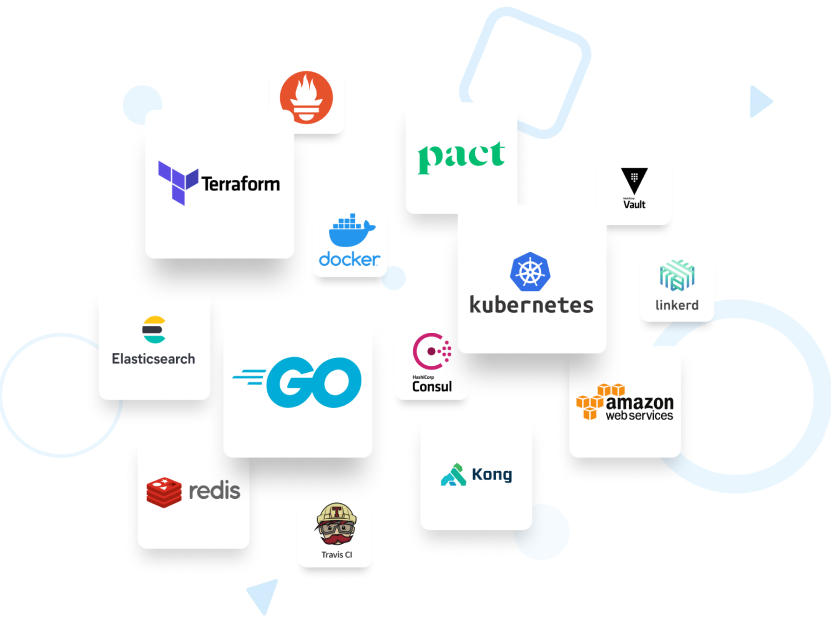

# Our stack 📚
 
 Here are a few of the tools and methodologies we utilise:

- **Infrastructure** : AWS, GCP, Kubernetes
- **Platform** : CockroachDB, Elasticsearch, PostgresDB, Vault, Consul, Linkerd, NATS
- **Tools** : Terraform, GitHub, Prometheus, Pact.io
- **Code** : Go, containerised microservices, CQRS, open-source
- **Ways of working** : TDD/BDD, Pair Programming, 100% remote, DevSecOps

[Check our StackOverflow!](https://stackoverflow.com/jobs/companies/form3-financial-cloud)

