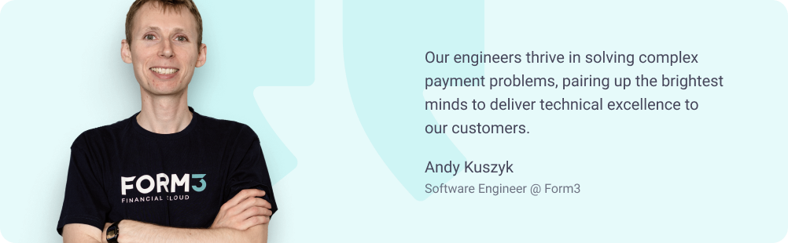

# What we look for 🔎

Passion for cloud-native technologies, modern infrastructures and tools, and keeping up with the latest in engineering best practices. Skilled in designing and building distributed, scalable systems and know-how to apply data structure and algorithms to create amazing solutions. Polyglots who are comfortable picking up new technologies, choosing the best tool for the job and writing the right kind of tests. Above all, we’re looking for enthusiastic engineers who love working in a DevOps culture and value teamwork, different perspectives and blending disciplines.

## We love to pair!

For us pair programming is a way of life and it goes hand-in-hand with a remote-first culture. It allows us to onboard new colleagues, knowledge share, work through complex projects, commit to frequent releases and maintain high code quality.

There are no ‘strict’ rules for pair programming, and we empower our engineers to decide if they feel it’ll be beneficial on a particular problem. Depending on the project, our engineers spend between 50%-70% of their time pair programming.

Our engineers thrive in solving complex payment problems, pairing up the brightest minds to deliver technical excellence to our customers.

    

